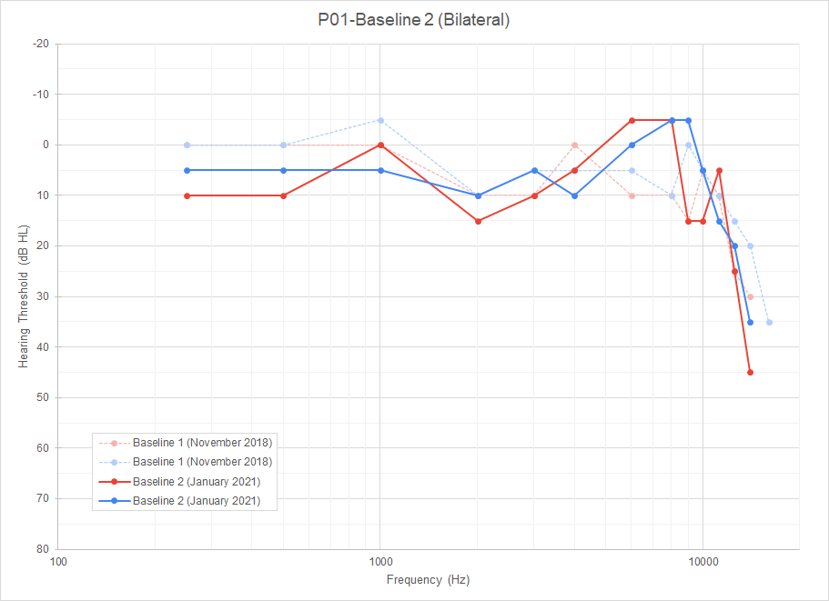

# elkhalil_and_fortier_project

BrainHack School 2021 project

<table>
  <tr>
    <td align="center">
      <a href="https://github.com/lilielkhalil">
        
         <b>Lili El Khalil</b>
      </a>
       
    </td>
    <td align="center">
      <a href="https://github.com/eddyfortier">
        
         <b>E. Fortier</b>
      </a>
       
    </td>
  </tr>
</table>

## Lili El Khalil's personal Backgroung

Hello !!

My name is Lili El Khalil,
I am in my first year of master student at University of Montreal studying psychology.
I am a research assistant with Marie Audrey Lavoie in the visual neurocognition laboratory.

<b> Why BrainHack School? </B>

When joining the BrainHack School, i was looking farward in particular to know more about data analyses and BIDS validation
Which means to be able to analyse my research data results later on and to know how to validate it with BIDS.

In my research Laboratory i was only working with Matlab and my university courses was only about HTML.
But in BrainHack School i had the opportunity to discover more than one application and method.

You can join me on GitHub at [lilielkhalil](https://github.com/lilielkhalil) or by mail at <lilykhalil98@gmail.com>

## E. Fortier's bio

Mr. Fortier is a Master student in Psychology at Université de Montréal.
Before that, he did a first Bachelor degree in Music writing (B. Mus.) and a second Bachelor degree in Cognitive neuroscience (B. Sc.).
Having backgrounds in both of these fields, his research interests include auditory perception, music perception and creation, and noise pollution's effects on perception and health (physical and mental).
He is currently part of the auditory perception and protection branch of the Projet Courtois NeuroMod (Centre de recherche de l'Institut universitaire de gériatrie de Montréal).

## Project Definition

## Project background

The Projet Courtois NeuroMod is a longitudinal fMRI data acquisition project where participants get scanned almost every week.
One risk associated with intensives protocols like this one is the chronic exposure of the participants to high noise levels during the scan sessions.
This is why it is important to regularly monitor their auditory health to ensure that the research protocol is not causing any damage to the participants' hearing.
Part of the auditory perception's job is to do this monitoring task.
To do so, the participants go through different clinical tests every month to keep track of the evolution of their auditory health.
Some of those test data, such as the pure-tone audiometry test data, are more easily interpreted when rendered into graphic displays.
But with these repeated test comes important amount of data to process.
A first task that could be interesting to do would be, in order to go through the data processing more efficiently, to build an automated pipeline to generate the graphs.

##### Exemple of audiogram

##### Exemple of Matrix test results graph

.png)

A second task that could be interesting to do would be to try and use these test data to try and fingerprint the participant based on their results to the tests.
Since every person's hearing is unique and is affected by the individual auditory experience, it could be interesting to try that kind of machine learning classification task.
The third task that could be interesting to do is regarding the dataset formatting.
Since the dataset is not currently BIDS compatible, it could be interesting to create a jupyter notebook to automatically create a BIDS format database from the data.

##### Exemple of a BIDS compatible file structure reformatting
(figure reference: Gorgolewski, K. J., Auer, T., Calhoun, V. D., Craddock, R. C., Das, S., Duff, E. P., Flandin, G., Ghosh, S. S., Glatard, T., Halchenko, Y. O., Handwerker, D. A., Hanke, M., Keator, D., Li, X., Michael, Z., Maumet, C., Nichols, B. N., Nichols, T. E., Pellman, J., … Poldrack, R. A. (2016). The brain imaging data structure, a format for organizing and describing outputs of neuroimaging experiments. *Scientific data*, *3*, 160044. https://doi.org/10.1038/sdata.2016.44)

## Tools

The plan is to use the following tools from the BrainHack School's tutorials in this project:

- Python scripts to execute the graph generation and machine learning tasks
- The Bash terminal environment to work on the python scripts and run them
- Git and GitHub for the collaborative work and the version control of the project
- Plotting libraries such as Matplotlib, Seaborn or Plotly
- Machine learning libraries for the fingerprinting task
- Jupyter Notebook to build and execute the BIDS formatting script
- The BIDS validator to make sure that the formatting worked
- Markdown to build this README.md file

## Data

The dataset used for this project was acquired through multiple sessions with each participant between November 2018 and June 2021.
Multiple clinical tests were performed including:
- Otoscopic inspection of the external auditory canal and tympanic membrane
- Tympanometry
- Stapedial reflex test
- Pure-tone audiometry
    - Regular clinical frequencies range (from 250 Hz to 8 kHz)
    - Ultra-high frequencies extended range (from 9 kHz to 20 kHz)
- Matrix speech-in-noise perception test
    - In the primary language of the participant: French or English (for all participants)
    - In the second language of the participant: French or English (for 5 out of the 6 participants)
- Otoacoustic emissions
    - Transitory evoked otoacoustic emissions (TEOAE)
    - Distortion product otoacoustic emissions (DPOAE) with a L1/L2 ratio of 65/55 dB SPL
    - Growth function (DP Growth) with 2 kHz, 4 kHz and 6 kHz

Baselines were acquired for each of these tests.
Three different combinations of those tests were then designed as experimental conditions and randomly assigned to each of the participant in a way that they will all do each of those conditions four times over the course of a twelve months protocol.

## Deliverables

By the end of The BrainHack School, we aimed to have the following:

- A README.md file to present the project
- A GitHub repository documenting the project
- Python scripts to create graphs and execute machine learning tasks
- Jupyter notebooks with code and explanations for the BIDS formatting task
- A [slideshow](https://docs.google.com/presentation/d/1TveZjzR9TDlGQA-XrLYjqPEb2E-x2vvl0kyfu43ljaQ/edit?usp=sharing) presentation showing the project results
 
## Results

#### Mr. Fortier's progress overview

A first iteration of functional python scripts to generation single test graphs and test overview graphs for each of the Projet Courtois NeuroMod participants is now available in the code folder of this repository.
These scripts were also linted using flake8 and passed all the generic requirements of this linter.

#### Tools and skills that were developped during this project

- **Python scripts**: It was a first attempt to code in python using scripts instead of the Jupyter Notebook controlled environment.
- **Python scripts**: It was also a first attempt at using multiple scripts for a single task and importing functions across them.
- **Git and Github**: This project is the first attempt at building a complete project from the start, using Git's functions and a Github repository.
- **Plot.ly's `graph_objects` tools**: This project was a first on many front regarding Plot.ly.
    - It was a first attempt at doing interactive figures/graphs.
    - It was a first contact with Plot.ly's library.
    - It was a challenge to be able to build graphs that fully represent the particularities of the two different types of figure produced in this project: `plotly.express` might have been easier to use than `plotly.graph_objects`, but it was not as capable to fully build the vision planned for this project.
    - It was an important challenge to navigate in the impressive documentation of the `plotly.graph_objects` library. It is a powerful, extensively customizable tool, but it is also very complex.
- **flake8 linter**: It was the first use of a linter to proof read the scripts' code format.
- **Binder**: It has been a difficult journey to try to figure out a way to make available here examples of the interactive figures generated by this project. Unfortunately, Github doesn't allow for html figures to be embeded into markdown files to be displayed. Binder was a way to go around it.
- **Jupyter Notebook**: In order to display the interactive figures through the use of Binder, two notebooks were created and adapted from the original graph_generator.py code.

##### Exemple of interactive HTML audiogram

##### Exemple of Matrix test interactive HTML graph

